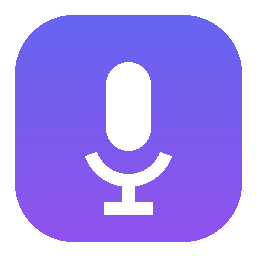

<p align="center">
  
</p>

# VoiceType — free, offline talk-to-type for Windows

A **100% free, fully offline** dictation app for Windows — a no-cost alternative to paid tools like Wispr Flow. Press **`Left Ctrl + Left Alt`**, talk, and your words appear in **any** app — email, browser, Word, chat, code editor — with **proper punctuation, capitalization, and grammar**.

Everything runs on **your own computer**. No accounts, no API keys, no subscription, no cloud. After a one-time model download it works with **no internet at all**, and it costs **nothing, ever**.

> Powered by [faster-whisper](https://github.com/SYSTRAN/faster-whisper) for speech recognition and [LanguageTool](https://languagetool.org/) for grammar — both free and open-source, both running locally.

---

## Why it's good

- **Excellent punctuation & capitalization** — Whisper is trained on real written text, so commas, periods, question marks, and capitals come out right.
- **Real grammar correction** — an optional local LanguageTool pass fixes spelling and grammar (e.g. *"i seen the report"* → *"I saw the report"*). Free, offline, uses your Java runtime.
- **Smart cleanup** — removes filler words ("um", "uh"), fixes spacing, capitalizes sentences, and understands spoken commands like **"new line"** and **"new paragraph"**.
- **Works everywhere** — types into whatever app is focused via clipboard paste.
- **Press once, talk, watch it type** — `Left Ctrl + Left Alt` (two easy bottom-left keys) starts dictation and your words appear **live**, a phrase at a time, as you speak. Stop whenever you're happy by clicking the **✕** on the pill (or press `Esc`, or the shortcut again). Rebind it to anything you like.
- **Lives in the tray** — a small icon shows status (idle / listening / transcribing) with a menu to tweak settings or quit. A floating pill shows a **mic icon** (red while listening), the latest words it just typed, and a **✕** stop button.
- **Private by design** — your voice never leaves your machine.

---

## Install — download, then double-click

**Easiest — the one-file installer:**

1. **[Download `VoiceType-Setup.exe`](https://github.com/kushalkolla/voice-to-text/raw/main/VoiceType-Setup.exe)** onto the PC you want to use it on.
2. **Double-click it.** (Windows may show a blue *"Windows protected your PC"* notice because the file is free and unsigned — click *More info → Run anyway*. It's the same VoiceType, just not paid-code-signed.)
3. Click through the **setup wizard** (Welcome → License → Install). It sets everything up and offers to launch VoiceType at the end.

It installs like a normal app under `…\AppData\Local\Programs\VoiceType`, no administrator needed, and shows up in **Settings → Apps** with a one-click **Uninstall**. Done.

**Or from the folder/zip:** download `VoiceType.zip`, extract it, and double-click **`Install.bat`** (same SmartScreen note applies).

Either way, no account, no login, no keys. The installer does everything, automatically and for free:

- installs **Python** (via `winget`) if it isn't already present,
- creates an isolated environment and installs the dependencies,
- installs a **Java** runtime for grammar correction (if missing),
- **downloads the speech model** (one-time, ~200–500 MB),
- starts VoiceType and makes it **launch automatically at login**, and
- adds Start Menu + Desktop shortcuts.

When it finishes, just click into any text box and press **`Left Ctrl + Left Alt`**.

<details>
<summary>Prefer the command line / want options?</summary>

```powershell
# Basic install:
powershell -ExecutionPolicy Bypass -File install.ps1

# Auto-start at login + Desktop shortcut (what Install.bat does):
powershell -ExecutionPolicy Bypass -File install.ps1 -StartOnLogin -Desktop

# Skip Java (grammar off) / skip the model pre-download:
powershell -ExecutionPolicy Bypass -File install.ps1 -NoJava -SkipModel
```

**No winget?** Install [Python 3.12](https://www.python.org/downloads/) (tick *"Add Python to PATH"*) and re-run.
</details>

<details>
<summary>Want to build the shareable installer yourself?</summary>

```powershell
# One-time: install the free Inno Setup compiler
winget install -e --id JRSoftware.InnoSetup

# Produces dist\VoiceType-Setup.exe (wizard) and dist\VoiceType.zip
powershell -ExecutionPolicy Bypass -File build-release.ps1
```

The installer wizard is built with **Inno Setup** ([installer/voicetype.iss](installer/voicetype.iss)) — free, no
code-signing cost. The `.exe` is small (~2 MB): it doesn't bundle Python/the model,
it sets those up on the target PC during install (one-time internet, ~1 GB), after
which the app runs fully offline. Hand someone either file in `dist\`.
</details>

---

## Use it

VoiceType runs in your system tray (it started after install and starts with Windows). To dictate:

1. **Click into any text box** — an email, a chat, a document, anywhere.
2. Press **`Left Ctrl + Left Alt`** once, then just talk. Your words appear **as you speak** — each time you pause, that phrase is punctuated, grammar-checked, and typed in. Keep going as long as you like.
3. **Stop when you're happy** — click the **✕** on the floating pill (or press **`Esc`**, or the shortcut again).

That's it — no need to press the hotkey a second time just to make text show up. To quit the app entirely, right-click the tray icon → **Quit**.

> **Live, phrase by phrase:** because everything runs locally on your CPU, each phrase appears a second or two after you pause — not letter-by-letter. It keeps up as you talk. If it feels too eager or too slow to cut phrases, tune `streaming.silence_ms` in `config.json` (lower = snappier, higher = waits for longer pauses).

> **Why `Left Ctrl + Left Alt`?** Two keys right next to each other in the bottom-left corner — easy to hit with one hand without looking. One trade-off: it shares its keys with `Ctrl+Alt+…` shortcuts (Ctrl+Alt+Del, screen-rotate, etc.), so those can toggle dictation too. If that bugs you, set `hotkeys.toggle` in `config.json` to a conflict-free key: `"caps lock"` (single left key), `"f9"`, or `"right ctrl+right shift"`. (`"windows+h"` uses the Windows voice-typing key — VoiceType then takes it over.)

**Spoken commands** (say them out loud while dictating):

| Say… | You get |
| --- | --- |
| "new line" | a line break |
| "new paragraph" | a blank line + new paragraph |
| "press enter" | a line break |
| "tab key" | a tab |
| "scratch that" / "delete that" | deletes the last thing it typed |
| "undo that" | sends Ctrl+Z to the app |

(Add your own in `postprocess.commands` / `postprocess.replacements` — e.g. map "my email" to your address.)

Press **`Esc`** (or click **✕**) to stop dictating — whatever was already typed stays put.

### Type in English while speaking another language
Turn on **tray → Translate to English** (or set `model.task` to `"translate"`). Speak Hindi, Spanish, anything — it types English. This needs a multilingual model, so also set `model.name` to `"small"` (or `base`/`medium`) and `model.language` to `null` in `config.json`. It's all still free and offline.

---

## Configure

Settings live in **`config.json`** (created automatically on first run; see `config.example.json` for a documented copy). Right-click the tray icon → **Edit settings…** to open it. A few highlights:

| Setting | What it does |
| --- | --- |
| `model.name` | Speech model. `auto` (default) picks `large-v3-turbo` on an NVIDIA GPU — near `large-v3` accuracy (multilingual, strong on accents/names) but several times faster (~2 GB VRAM, one-time download) — and the light `small.en` on CPU. Pin one to override: `large-v3` (max accuracy, slower), `medium.en`/`small.en` (lighter). Use a non-`.en` model + `model.language` for other languages. |
| `streaming.enabled` | `true` (default) types live as you speak and you stop with **✕** / `Esc`. Set `false` for the classic flow: press once to record, press again to transcribe the whole thing at once. |
| `streaming.silence_ms` | How long a pause ends a phrase and types it (default `500`). Lower = text appears sooner but may chop mid-sentence; higher = waits for clearer pauses. |
| `streaming.energy_floor` / `streaming.energy_mult` | Speech-detection sensitivity. If quiet talking gets missed, lower these; if background noise triggers stray text, raise them. |
| `hotkeys.toggle` | The start (and also stop) key. Default `"left ctrl+left alt"`. Rebind to anything — e.g. the conflict-free `"caps lock"`, `"right ctrl+right shift"`, a single `"f9"`, or `"windows+h"` to use the Windows key. |
| `hotkeys.push_to_talk` | Optional hold-to-talk key (off by default). Set e.g. `"right ctrl"` to also hold a key to dictate. |
| `hotkeys.suppress_toggle` | Only matters if `toggle` is `"windows+h"` — keep `true` so VoiceType overrides Windows' built-in voice typing. Auto-ignored for any other key. |
| `grammar.enabled` | Turn grammar correction on/off (also in the tray menu). |
| `postprocess.fillers` | Words removed as fillers. |
| `postprocess.commands` | Add your own spoken commands. |
| `postprocess.replacements` | Custom dictionary, e.g. `{"github": "GitHub"}` to fix names/jargon — these also bias recognition so the words come out right in the first place. |
| `injection.method` | `"paste"` (default) or `"type"` if an app blocks paste. |
| `ui.show_overlay` / `ui.sounds` | Toggle the floating pill / the start-stop beeps. |

After editing `config.json`, restart VoiceType (tray → Quit, then start again).

---

## Command-line options

Run these from this folder (the installer made a `.venv` here):

```powershell
.\.venv\Scripts\python -m voicetype --selftest       # test the text/grammar pipeline (no mic)
.\.venv\Scripts\python -m voicetype --list-devices   # list microphones
.\.venv\Scripts\python -m voicetype --download       # (re)download the speech model
```

---

## NVIDIA GPU acceleration — automatic

One installer fits every machine. The installer **detects an NVIDIA GPU** and, if it finds one, installs the free CUDA libraries automatically for **~10–20× faster** dictation (e.g. a 6-second clip drops from ~2.2 s on CPU to ~0.1 s on a laptop RTX 4070). No GPU? It stays lean on the CPU and still works great — nothing extra to download.

VoiceType auto-detects a *working* GPU at runtime and always falls back to CPU if anything's missing or incompatible, so it never breaks.

```powershell
# Force GPU libs on (e.g. you'll move the install to an NVIDIA machine):
powershell -ExecutionPolicy Bypass -File install.ps1 -Gpu

# Force CPU-only (skip the ~1.2 GB GPU download):
powershell -ExecutionPolicy Bypass -File install.ps1 -NoGpu

# Or add them to an existing install by hand:
.\.venv\Scripts\pip install -r requirements-gpu.txt
```

---

## Uninstall

```powershell
powershell -ExecutionPolicy Bypass -File uninstall.ps1          # remove env + shortcuts
powershell -ExecutionPolicy Bypass -File uninstall.ps1 -Purge   # also delete downloaded model/grammar
```

---

## How it works

```
Microphone → record (16 kHz) → faster-whisper (local) → cleanup → LanguageTool (local) → cleanup → paste into focused app
```

No audio or text ever leaves your computer. The only network use is the one-time download of the speech model and grammar engine.

---

## Ultra-light fallback (no install)

Don't want to install anything at all? Windows 10/11 ships with a basic built-in voice typing — the very thing `Win + H` opens when VoiceType isn't running. This repo keeps a tiny launcher for it (`Open Voice Typing.bat` / `open-voice-typing.ps1`), but it's far more limited: no custom punctuation, no grammar, no spoken commands, because the text goes straight from Windows into your app without passing through this tool. VoiceType exists to replace it.

---

## Requirements

- Windows 10 or 11
- A microphone
- ~1 GB free disk space (Python + speech model + grammar engine)
- Everything else is installed for you, free.

## License

MIT — see [LICENSE](LICENSE).
